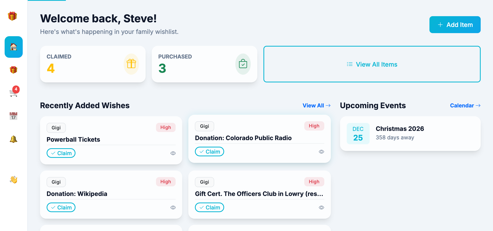
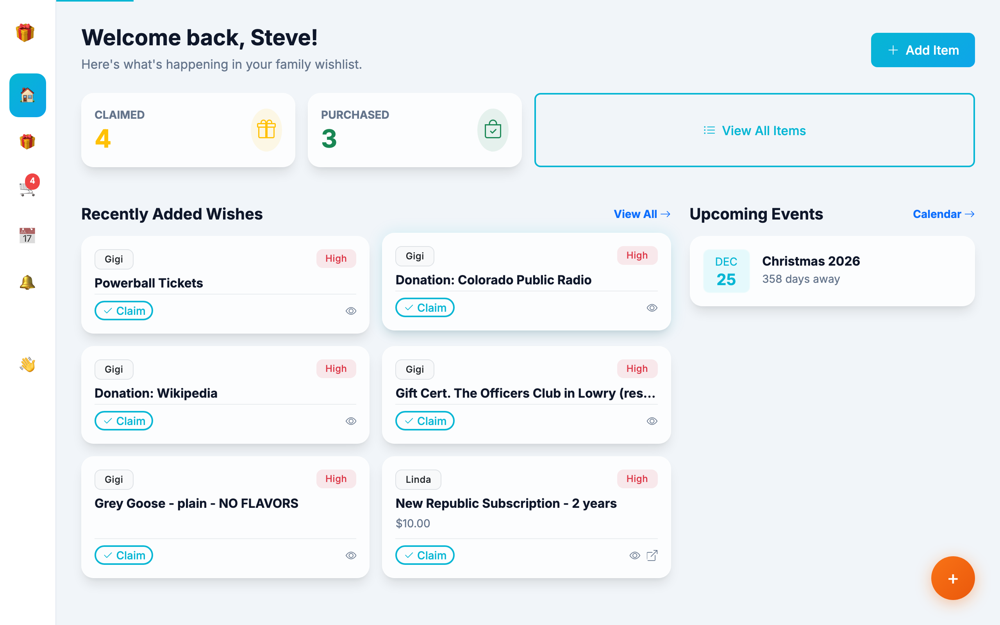
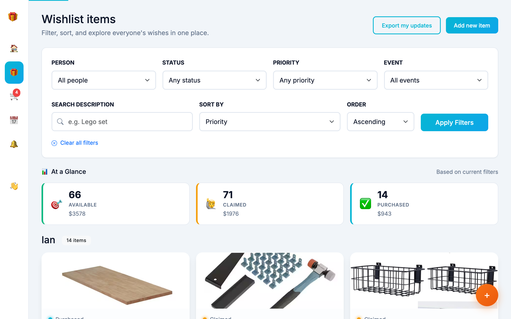
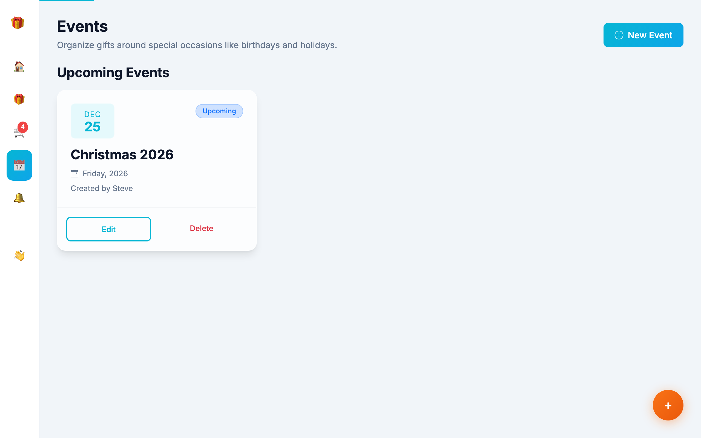
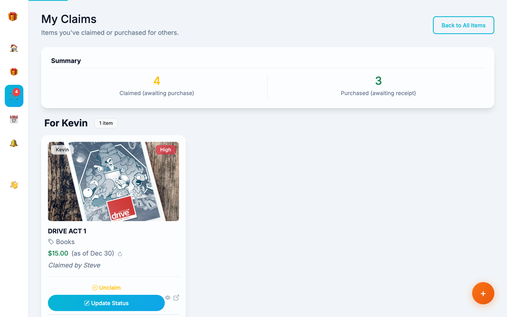
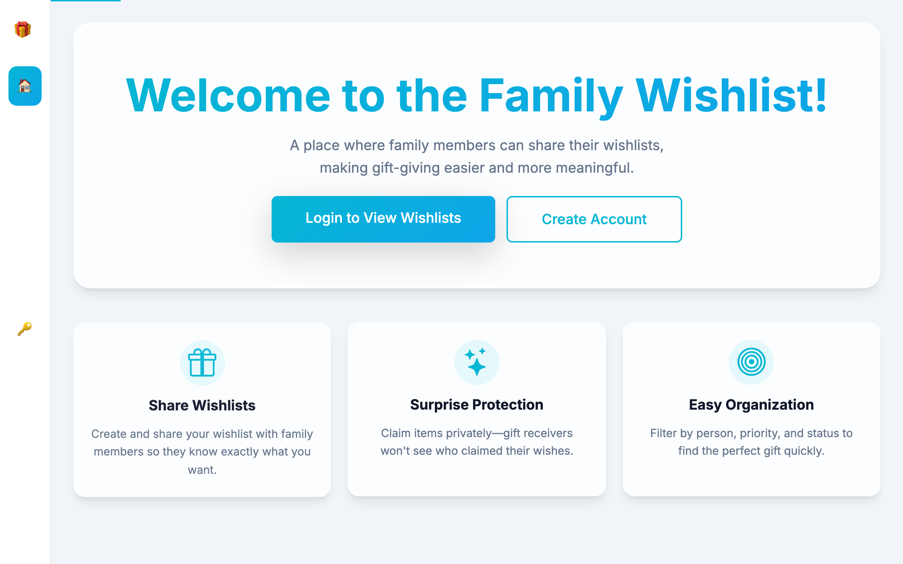
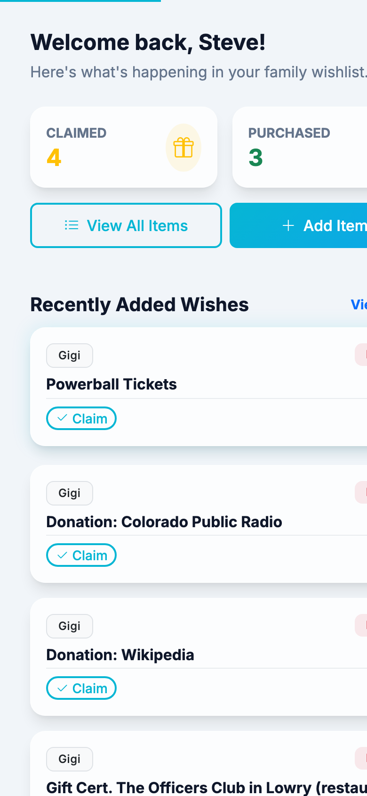

# Family Wishlist

A beautiful, modern web application for families to share wishlists and coordinate gift-giving while keeping surprises intact.

<p align="center">
  
</p>

## Features

### Dashboard
The home dashboard provides a quick overview of recent wishes and upcoming events, making it easy to stay on top of gift-giving opportunities.



### Wishlist Management
- **Add Items** - Create wishlist items with descriptions, links, prices, images, and priority levels
- **Quick Claim** - Claim items directly from the dashboard or item list with a single click
- **Smart Filtering** - Filter by person, status, priority, event, and search terms
- **Price Tracking** - Automatic price fetching from product URLs with refresh capability



### Surprise Protection
The app intelligently hides claim information from gift recipients, ensuring surprises aren't spoiled. You can see who claimed items on other people's lists, but never your own.

### Quick View Modal
Preview item details without leaving the page. View prices, notes, and claim status in a sleek modal overlay.

### Events Calendar
Track birthdays, holidays, and special occasions. Associate wishlist items with specific events to help gift-givers plan ahead.



### My Claims
A dedicated page to track all items you've claimed or purchased, with easy status updates.



### Comments & Coordination
Leave private comments on items (hidden from the gift recipient) to coordinate with other family members about gift-giving plans.

### Welcome Page
A clean, inviting landing page for new and returning users.



### Modern UI
- Glassmorphism design with smooth animations
- Dark/Light theme support
- Fully responsive for mobile, tablet, and desktop
- Bootstrap 5.3 with custom styling

<p align="center">
  
</p>

## Tech Stack

| Category | Technology |
|----------|------------|
| Backend | Flask (Python) |
| Database | SQLite (dev) / PostgreSQL (prod) |
| Frontend | Bootstrap 5.3, htmx |
| Services | Redis (Rate Limiting), Sentry (Monitoring) |
| Hosting | Heroku |
| Testing | pytest, Playwright |
| CI/CD | GitHub Actions |

## Quick Start

### Prerequisites
- Python 3.8+
- pip
- Docker (Docker Desktop or Colima for macOS)

### Docker on macOS (Apple Silicon)
If using Apple Silicon (M1/M2/M3), we recommend using **Colima** with the ARM64 binaries to avoid Rosetta issues.

```bash
# Install Colima and Docker CLI (if not already installed)
brew install colima docker docker-compose

# Start Colima with x86_64 emulation support (optional, but app runs natively)
colima start
```

### Installation

```bash
# Clone the repository
git clone https://github.com/ssk42/flask-wishlist-site.git
cd flask-wishlist-site

# Create and activate virtual environment
python -m venv venv
source venv/bin/activate  # Unix/macOS
# or
.\venv\Scripts\activate   # Windows

# Install dependencies
pip install -r requirements.txt

# Initialize the database
flask db upgrade


# Run the application
make up

Visit `http://localhost:5001` in your browser. (Note: Port 5001 is used to avoid AirPlay conflicts on macOS)

### Environment Variables

Copy `.env.example` to `.env` and configure:

```bash
SECRET_KEY=your-secret-key-here
FAMILY_PASSWORD=your-shared-family-password  # Required for registration/login
DATABASE_URL=postgresql://...  # For production
SENTRY_DSN=https://...         # Optional: Error tracking
```

## Testing

The project maintains **90%+ code coverage** with comprehensive unit and browser tests.

```bash
# Install test dependencies (including Playwright browsers)
pip install -r requirements.txt
playwright install --with-deps chromium

# Run all tests
pytest

# Run only unit tests
pytest tests/unit/

# Run only browser tests
pytest tests/browser/
```

## Deployment

### Heroku

```bash
# Login to Heroku
heroku login

# Create app (if not exists)
heroku create your-app-name

# Set environment variables
heroku config:set SECRET_KEY=your-secret-key

# Deploy
git push heroku main

# Configure Production Secrets
heroku config:set SECRET_KEY=your-secret-key
heroku config:set FAMILY_PASSWORD=your-secure-shared-password

# Add Redis (Required for Rate Limiting)
heroku addons:create heroku-redis:mini
```

The `Procfile` handles automatic database migrations on each deploy.

## Project Structure

```
.
├── app.py                 # Main application (routes, models, config)
├── templates/             # Jinja2 templates
│   ├── base.html          # Base layout with nav & theme
│   ├── index.html         # Dashboard
│   ├── items_list.html    # All items view
│   ├── partials/          # Reusable components
│   │   ├── _item_card.html
│   │   ├── _dashboard_item_card.html
│   │   └── _item_quick_view.html
│   └── ...
├── static/
│   ├── css/main.css       # Custom styles
│   └── js/theme.js        # Theme toggle
├── tests/
│   ├── unit/              # Flask test client tests
│   └── browser/           # Playwright E2E tests
├── migrations/            # Alembic database migrations
└── docs/screenshots/      # README images
```

## Screenshots

Screenshots are captured using Playwright. To regenerate them:

```bash
# Set your test user email and run the script
TEST_EMAIL=your@email.com python scripts/take_screenshots.py
```

This will save screenshots to `docs/screenshots/`.

## Contributing

1. Fork the repository
2. Create a feature branch (`git checkout -b feature/amazing-feature`)
3. Commit your changes (`git commit -m 'Add amazing feature'`)
4. Push to the branch (`git push origin feature/amazing-feature`)
5. Open a Pull Request

All PRs must pass the test suite before merging.

## Security Features

- CSRF protection on all forms and htmx requests
- Security headers (X-Content-Type-Options, X-Frame-Options, HSTS)

- **Shared Family Password**: A single shared code is required for all registrations and logins, preventing unauthorized public access.
- Email-based user identity (passwords not stored per user)
- Surprise protection prevents gift recipients from seeing claim status

## License

This project is private and intended for family use.

## Author

**Steve Reitz** - [GitHub](https://github.com/ssk42)

---

<p align="center">
  <i>Making gift-giving easier, one wish at a time.</i>
</p>
